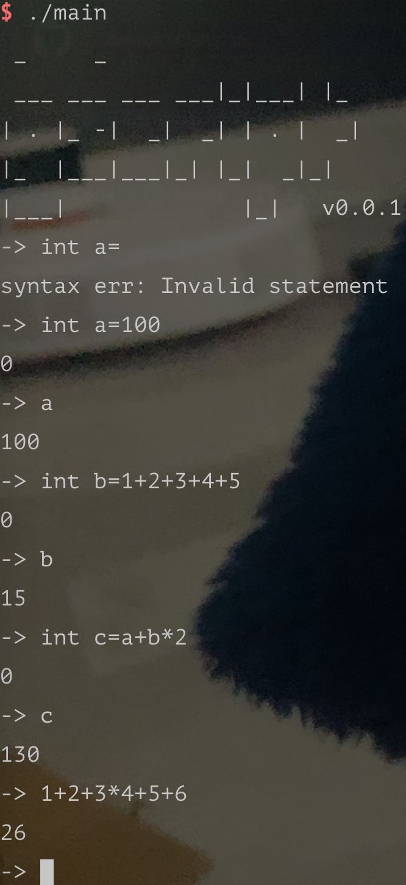
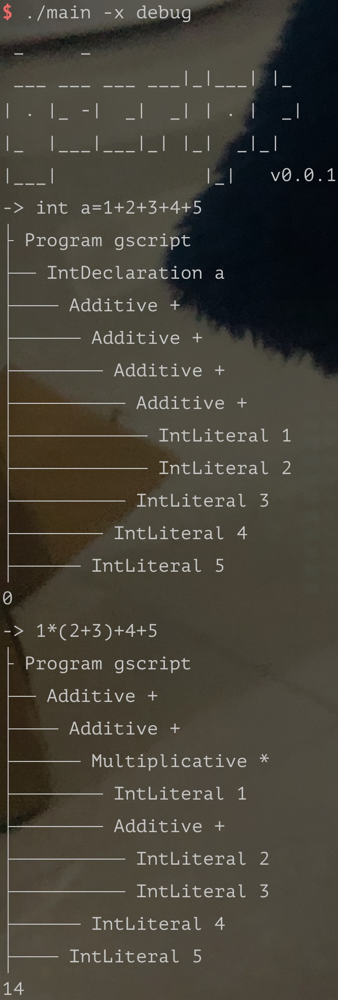

# Gscript
This is a small script language, and helps beginners to learn compilation principles.

> It is called Gscript because it is written with Go.

# Features

- [x] Basic quadratic operations.
- [ ] Support scope and function.
- [ ] Support closure.
- [ ] OOP.