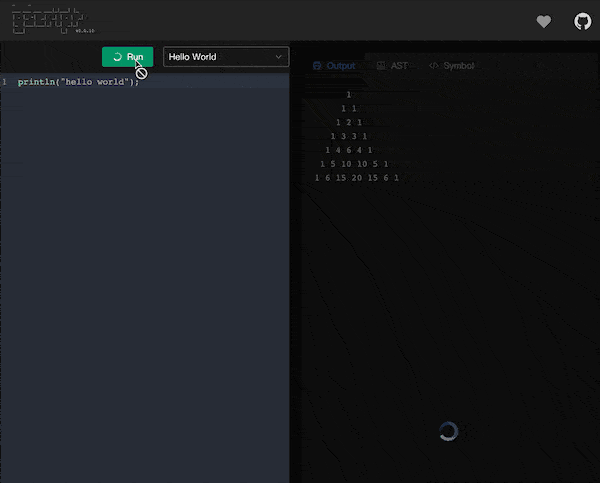
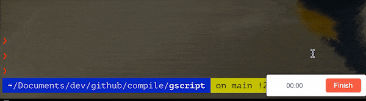

<div align="center">  

```
 _     _   
 ___ ___ ___ ___|_|___| |_ 
| . |_ -|  _|  _| | . |  _|
|_  |___|___|_| |_|  _|_|  
|___|             |_|   

```

🎮[Play](#playground) | 📘[Features](#features) | 🌰[Demo](#demo) | 🔧[Install](#install) | 👾[REPL](#repl) | 🎉[Syntax](#syntax) | 🎁[Standard library](#standard-library)  | 💡[Contact Author](#contact-author) | 🇨🇳[中文](https://github.com/crossoverJie/gscript/blob/main/README-ZH.md)


</div><br>

# Introduction

This is a **statically and strongly** typed language written in Go, the syntax of Java and Go is referenced.

## Target
Provides the ability to write Go language in script form, retains the advantages of Go language (goroutine, etc.), and adds more syntactic sugar for ease of use.

> The current Alpha version is for study and experimentation only.

hello_world.gs:

```js
println("hello world");
```

```shell
❯ gscript hello_world.gs
hello world
```

# Playground

Online address: [https://gscript.crossoverjie.top/](https://gscript.crossoverjie.top/)



# Features

- [x] [Class declaration](#class)
- [x] [Function declaration and call](#function)
- [x] [Primitive type](#primitive): `int/string/float/bool/byte`
- [x] [Array type](#array)
- [x] `nil` type
- [x] [`any` type](#any-type)
- [x] [Function type](#closure)
- [x] [Closure：Functions as First-Class Objects](#closure)
- [x] [Native function](#native-function)
- [x] [Standard library](#standard-library)
	- [x] [Map](#map)
- [x] [Variable arguments](#variable-arguments)
- [x] [Operator overloading](#operator-overloading)
- [x] [Native support](#native-function) `json`
- [x] [Native support `http`](#http)
- [x] Example
	- [x] LeetCode
		- [x] [LeetCode: Linked list cycle](https://github.com/crossoverJie/gscript/blob/main/example/linked_list_cycle141.gs)
		- [x] [LeetCode: Two sum](https://github.com/crossoverJie/gscript/blob/main/example/leetcode/two_sum.gs)
	- [x] [Print fibonacci](#print-fibonacci)
	- [x] [Print YangHui triangle](#yanghui-triangle)
	- [x] [HTTP Service](https://github.com/crossoverJie/gscript/blob/main/example/http_server.gs)
- [ ] PKG manager
- [ ] Unit Test command line


# Demo

## Hello world
```js
println("hello world");
```

## Print fibonacci

```js
func int() fib(){
    int a = 0;
    int b = 1;
    int fibonacci(){
        int c = a;
        a = b;
        b = a+c;
        return c;
    }
    return fibonacci;
}

func int() f = fib();

for (int i = 0; i < 10; i++){
    println(f());
}
```

## Webapp

This is a dynamic web application written in `GScript`.

[https://gscript.crossoverjie.top/index](https://gscript.crossoverjie.top/index)

Source code：
[https://github.com/crossoverjie/gscript-homepage](https://github.com/crossoverjie/gscript-homepage)

## YangHui triangle
```js
int num(int x,int y){
	if (y==1 || y ==x) {
		return 1;
	}
    int v1 = num(x - 1, y - 1);
    int v2 = num(x - 1, y);
	int c = v1+v2;
    // int c = num(x - 1, y - 1)+num(x - 1, y);
	return c;
}

printTriangle(int row){
	for (int i = 1; i <= row; i++) {
        for (int j = 1; j <= row - i; j++) {
           print(" ");
        }
        for (int j = 1; j <= i; j++) {
            print(num(i, j) + " ");
        }
        println("");
    }
}

printTriangle(7);

// output:
      1 
     1 1 
    1 2 1 
   1 3 3 1 
  1 4 6 4 1 
 1 5 10 10 5 1 
1 6 15 20 15 6 1
```

---

More examples:[https://github.com/crossoverJie/gscript/tree/main/example](https://github.com/crossoverJie/gscript/tree/main/example)

# Install

## Binary

Download the latest binaries [here](https://github.com/crossoverJie/gscript/releases)

## 🐳Docker

```shell
docker pull crossoverjie/gscript
```

### REPL
```shell
docker run --rm -it  crossoverjie/gscript:latest gscript
```

### Run script
```shell
docker run --rm -v $PWD:/usr/src/gscript -w /usr/src/gscript crossoverjie/gscript gscript {yourpath}/temp.gs
```

## Build from Source Code

```shell
git clone https://github.com/crossoverJie/gscript.git
cd gscript
make build-code
./gscript
```

# REPL
```shell
> ./gscript 
```



# Syntax

## Primitive

The current version supports four primitive type: `int/string/float/bool` and `nil` type.

Variable declaration syntax: `type identifier (= expr)?`.

```js
int a=10;
string b,c;
float e = 10.1;
bool f = false;
byte by = 1;
string x = ^
{
    "name": "bob",
    "age": 20,
    "skill": {
        "lang": [
            {
                "go": {
                    "feature": [
                        "goroutine",
                        true
                    ]
                }
            }
        ]
    }
}^
```

## Array
Array declaration syntax: `('[' DECIMAL_LITERAL ']')? '{' (variableInitializer (',' variableInitializer)* (',')? )? '}'`

```js
// Declare and initialize
int[] a={1,2,3};
println(a);

// Declare an empty array and specify the length
int[] table = [4]{};

println("");
// Append data to array.
append(a,4);
println(a);
for(int i=0;i<len(a);i++){
	println(a[i]);
}

// Access to data by index.
int b=a[2];
println(b);

// byte array
string s = "10";
byte[] a= toByteArray(s);
printf("a=%v ",a);
string s1 = toString(a);
printf("s1=%s",s1);
assertEqual(s1,s);

// slice an array into a new array.
int[] a = {1,2,3};
int s=1;
int[] b = a[s:len(a)];
println(b);
// output: [2 3]
```

## any type
An `any` type may hold values of all type.
```js
any a =10;
println(a);

int fun1(any a,int b){
	return a+b;
}
int v =fun1(1,2);
println(v);
assertEqual(v,3);

any v2 = fun1(1,2);
println(v2);
assertEqual(v2,3);

int fun2(int a, any b){
	return a+b;
}
int v3 =fun2(1,2);
println(v3);
assertEqual(v3,3);

int fun3(any a, any b){
	return a+b;
}
int v4 =fun3(1,2);
println(v4);
assertEqual(v4,3);

int fun4(any a, any b){
	return a+b;
}
string v5 =fun4("10", "20");
println(v5);
assertEqual(v5,"1020");
```

Example: [Standard library](https://github.com/crossoverJie/gscript/blob/main/internal/internal.gs#L25)

## Class
```js
class ListNode{
    int value;
    ListNode next;
    ListNode(int v, ListNode n){
        value =v;
        next = n;
    }
}

// The new keyword is not required to call the constructor.
ListNode l1 = ListNode(1, nil);

// Using . to access object property or method.
println(l1.value);
```

The default comes with a parameterless constructor

```js
class Person{
	int age=10;
	string name="abc";
	int getAge(){
		return 100+age;
	}
}

// parameterless constructor
Person xx= Person();
println(xx.age);
assertEqual(xx.age, 10);
println(xx.getAge());
assertEqual(xx.getAge(), 110);
```

## function

```js
// cycle linked list
bool hasCycle(ListNode head){
    if (head == nil){
        return false;
    }
    if (head.next == nil){
        return false;
    }

    ListNode fast = head.next;
    ListNode slow = head;
    bool ret = false;
    for (fast.next != nil){
        if (fast.next == nil){
            return false;
        }
        if (fast.next.next == nil){
            return false;
        }
        if (slow.next == nil){
            return false;
        }
        if (fast == slow){
            ret = true;
            return true;
        }

        fast = fast.next.next;
        slow = slow.next;
    }
    return ret;
}

ListNode l1 = ListNode(1, nil);
bool b1 =hasCycle(l1);
println(b1);
assertEqual(b1, false);

ListNode l4 = ListNode(4, nil);
ListNode l3 = ListNode(3, l4);
ListNode l2 = ListNode(2, l3);
bool b2 = hasCycle(l2);
println(b2);
assertEqual(b2, false);

l4.next = l2;
bool b3 = hasCycle(l2);
println(b3);
assertEqual(b3, true);
```

Function declaration syntax: `typeTypeOrVoid? IDENTIFIER formalParameters ('[' ']')*`

```js
add(int a){}
```

> When there is no return value, the return type can also be ignored.


## Closure

Function type syntax: `func typeTypeOrVoid '(' typeList? ')'`

```js
// External variable, global shared.
int varExternal =10;
func int(int) f1(){
	// Closure variable.
	int varInner = 20;
	int innerFun(int a){
		println(a);
		int c=100;
		varExternal++;
		varInner++;
		return varInner;
	}
	return innerFun;
}

// f2 is a function type, the return type and parameter are both int.
func int(int) f2 = f1();
for(int i=0;i<2;i++){
	println("varInner=" + f2(i) + ", varExternal=" + varExternal);
}
println("=======");
func int(int) f3 = f1();
for(int i=0;i<2;i++){
	println("varInner=" + f3(i) + ", varExternal=" + varExternal);
}
```

Output:

```shell
0
varInner=21, varExternal=11
1
varInner=22, varExternal=12
=======
0
varInner=21, varExternal=13
1
varInner=22, varExternal=14

```

## Variable arguments

`GScript` also support variable arguments：

```js
int add(string s, int ...num){
	println(s);
	int sum = 0;
	for(int i=0;i<len(num);i++){
		int v = num[i];
		sum = sum+v;
	}
	return sum;
}
int x = add("abc", 1,2,3,4);
println(x);
assertEqual(x, 10);
```

## Operator overloading

Operator that `Gscript` support:

- `+-*/`
- `== != < <= > >=`

> Overloading function must be **operator**, and append operator.

```js
class Person{
	int age;
	Person(int a){
		age = a;
	}
}
Person operator + (Person p1, Person p2){
	Person pp = Person(p1.age+p2.age);
	return pp;
}
Person operator - (Person p1, Person p2){
	Person pp = Person(p1.age-p2.age);
	return pp;
}
Person operator * (Person p1, Person p2){
	Person pp = Person(p1.age * p2.age);
	return pp;
}
Person operator / (Person p1, Person p2){
	Person pp = Person(p1.age / p2.age);
	return pp;
}
bool operator == (Person p1, Person p2){
	return p1.age==p2.age;
}
bool operator != (Person p1, Person p2){
	return p1.age!=p2.age;
}
bool operator > (Person p1, Person p2){
	return p1.age>p2.age;
}
bool operator >= (Person p1, Person p2){
	return p1.age>=p2.age;
}
bool operator < (Person p1, Person p2){
	return p1.age<p2.age;
}
bool operator <= (Person p1, Person p2){
	return p1.age<=p2.age;
}
Person p1 = Person(10);
Person p2 = Person(20);
//Person p3 =  operator(p1,p2);
Person p3 = p1+p2;
println("p3.age="+p3.age);
assertEqual(p3.age, 30);

Person p4 = p1-p2;
println("p4.age="+p4.age);
println(100-10);

Person p5 = p1*p2;
println("p5.age="+p5.age);
assertEqual(p5.age, 200);

Person p6 = p2/p1;
println("p6.age="+p6.age);
assertEqual(p6.age, 2);

bool b1 = p1 == p2;
println("b1=="+b1);
assertEqual(b1,false);

bool b2 = p1 != p2;
println("b2=="+b2);
assertEqual(b2,true);

bool b3 = p1 > p2;
println("b3=="+b3);
assertEqual(b3,false);

bool b4 = p1 >= p2;
println("b4=="+b4);
assertEqual(b4,false);

bool b5 = p1 < p2;
println("b5=="+b5);
assertEqual(b5,true);

bool b6 = p1 <= p2;
println("b6=="+b6);
assertEqual(b6,true);
```


More examples: [https://github.com/crossoverJie/gscript/tree/main/example](https://github.com/crossoverJie/gscript/tree/main/example)

# Standard library

Standard library source code: [https://github.com/crossoverJie/gscript/tree/main/internal](https://github.com/crossoverJie/gscript/tree/main/internal)


## Native function
```js

printf("hello %s ","123");
printf("hello-%s-%s ","123","abc");
printf("hello-%s-%d ","123",123);

string s = sprintf("nice to meet %s", "you");
println(s);
assertEqual(s,"nice to meet you");

int[] a={1,2,3};
// len return array length.
println(len(a));

// Append data to array.
append(a,4);
println(a);
// output: [1,2,3,4]

// Assert function
assertEqual(len(a),4);

// Return hashcode
int hashcode = hash(key);


// Serialize to JSON string.
class P{
	string name;
	P(string n){
		name = n;
	}
}
class Object{
	P p;
	int x;
	Object(P pp, int xx){
		p = pp;
		x = xx;
	}
}
P p1 = P("abc");
Object o1 = Object(p1, 100);
string json = JSON(o1);
println(json); //{"p":{"name":"abc"},"x":100}

// Query json with path
int x = JSONGet(json,"x");
println(x);
assertEqual(x,100);

string name = JSONGet(json,"p.name");
println(name);
assertEqual(name,"abc");

// Get command-line arguments.
System s = System();
string[] args = s.getOSArgs();
```

> Reference JSON query syntax: [xjson](https://github.com/crossoverJie/xjson#arithmetic-syntax)
# Map

## Function Definition
```js
class Map{
	put(any key, any value){}
	any get(any key){}
}
```

## Usage

```js
int count =100;
Map m1 = Map();
for (int i=0;i<count;i++){
	string key = i+"";
	string value = key;
	m1.put(key,value);
}
println(m1.getSize());
assertEqual(m1.getSize(),count);

for (int i=0;i<count;i++){
	string key = i+"";
	string value = m1.get(key);
	println("key="+key+ ":"+ value);
	assertEqual(key,value);
}
```

# StringBuilder
## Function Definition

```java
class StringBuilder{
	byte[] buf = [0]{};

	// append contents to buf, it returns the length of s
	int writeString(string s){}

	// append b to buf, it returns the length of b.
	int WriteBytes(byte[] b){}

	// copies the buffer to a new.
	grow(int n){}

	string String(){}
}
```

## Usage
```java
StringBuilder b = StringBuilder();
b.writeString("10");
b.writeString("20");
int l = b.writeString("30");
string s = b.String();
printf("s:%s, len=%d ",s,l);
assertEqual(s,"102030");
byte[] b2 = toByteArray("40");
b.WriteBytes(b2);
s = b.String();
assertEqual(s,"10203040");
println(s);
```

# Strings
## Function Definition

```java
class Strings{
	// concatenates the elements of its first argument to create a single string. The separator
	// string sep is placed between elements in the resulting string.
	string join(string[] elems, string sep){}

	// tests whether the string s begins with prefix.
	bool hasPrefix(string s, string prefix){}
}
```

## Usage

```java
Strings s = Strings();
string[] elems = {"name=xxx","age=xx"};
string ret = s.join(elems, "&");
println(ret);
assertEqual(ret, "name=xxx&age=xx");

bool b = s.hasPrefix("http://www.xx.com", "http");
println(b);
assertEqual(b,true);
b = s.hasPrefix("http://www.xx.com", "https");
println(b);
assertEqual(b,false);
```

# http
Standard library:

```js
// http lib
// Response json
FprintfJSON(int code, string path, string json){}
// Resonse html
FprintfHTML(int code, string path, string html){}

// path (relative paths may omit leading slash)
string QueryPath(string path){}

string FormValue(string path, string key){}
class HttpContext{
    string path;
    JSON(int code, any v){
        string json = JSON(v);
        FprintfJSON(code, path, json);
    }
    HTML(int code, any v) {
        string html = v;
        FprintfHTML(code, path, html);
    }
    string queryPath() {
        string p = QueryPath(path);
        return p;
    }

    string formValue(string key){
        string v = FormValue(path, key);
        return v;
    }
}
// Bind route
httpHandle(string method, string path, func (HttpContext) handle){
    // println("path="+path);
    HttpContext ctx = HttpContext();
    handle(ctx);
}
// Run http server.
httpRun(string addr){}
```

Start http service:

```js
class Person{
    string name;
}
func (HttpContext) handle (HttpContext ctx){
    Person p = Person();
    p.name = "abc";
    println("p.name=" + p.name);
    println("ctx=" + ctx);
    ctx.JSON(200, p);
}

func (HttpContext) handle1 (HttpContext ctx){
    Person p = Person();
    p.name = "def";
    println("p.name=" + p.name);
    println("ctx=" + ctx);
    ctx.JSON(200, p);
}
func (HttpContext) handle2 (HttpContext ctx){
    DateTime d = DateTime();
    string local = d.getCurrentTime("Asia/Shanghai","2006-01-02 15:04:05");
    println(local);
    string html =^
    <html>
    <title>hello</title>
    <h1>current ^+ local +^</h1>
    <p>hahaha</p>
    </html>
    ^;
    string queryPath = ctx.queryPath();
    println("queryPath = " + queryPath);

    // http://127.0.0.1:8000/p/2?id=100
    string id = ctx.formValue("id");
    println("id="+id);
    ctx.HTML(200, html);
}
httpHandle("get", "/p", handle);
httpHandle("get", "/p/1", handle1);
httpHandle("get", "/p/2", handle2);
httpRun(":8000");

```


## Contact author


> crossoverJie#gmail.com

 

