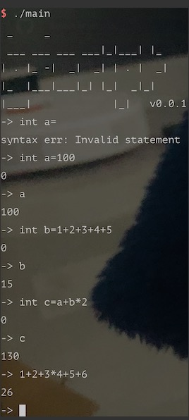
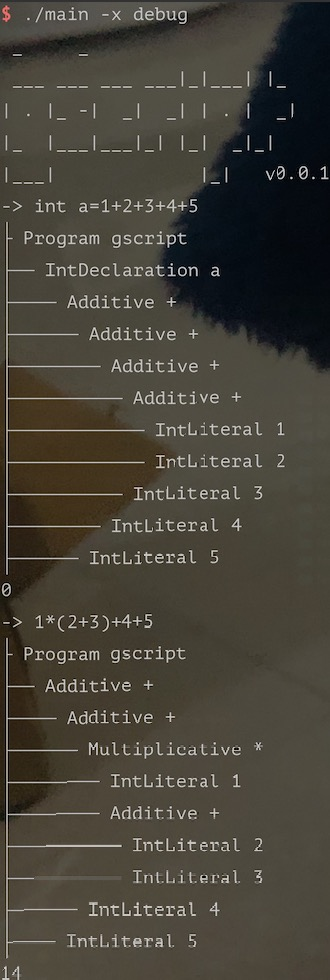

```
 _     _   
 ___ ___ ___ ___|_|___| |_ 
| . |_ -|  _|  _| | . |  _|
|_  |___|___|_| |_|  _|_|  
|___|             |_|   

```

This is a small script language, and helps beginners to learn compilation principles.

> It is called Gscript because it is written with Go.

# Installation

```go
go get github.com/crossoverJie/gscript
```

Or download the [binary file](https://github.com/crossoverJie/gscript/releases) directly

# Features

- [x] Basic quadratic operations
- [ ] Support scope and function
- [ ] Support closure
- [ ] OOP




