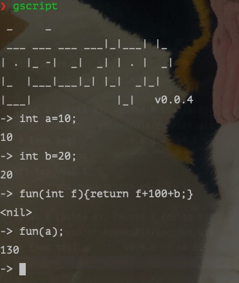

```
 _     _   
 ___ ___ ___ ___|_|___| |_ 
| . |_ -|  _|  _| | . |  _|
|_  |___|___|_| |_|  _|_|  
|___|             |_|   

```

<div align="center">  


📘[Features](#features) 🌰[Demo](#demo)🔧[安装](https://github.com/crossoverJie/gscript/releases)💡 [Contact Author](#contact-author)|🇨🇳[中文文档](https://github.com/crossoverjie/gscript/blob/master/README-ZH.md)


</div><br>

# Introduction

This is an experimental script language. and helps beginners to learn compilation principles.

> It is called GScript because it is written with Go.


# Demo

```java
int b= 10;
int foo(int age){
	for(int i=0;i<10;i++){
		age++;
	}
	return b+age;
}
int add(int a,int b) {
	int e = foo(10);
	e = e+10;
	return a+b+3+e;
}
add(2,20);
// Output:65
```

# Installation

```shell
go install github.com/crossoverJie/gscript/cmd@latest

gscript -h
```

Or download the [binary file](https://github.com/crossoverJie/gscript/releases) directly

# Features

- [x] Basic quadratic operations
- [x] Scope and function.
- [ ] More basic type
- [ ] Support scope and function
- [ ] Support closure
- [ ] OOP




## Contact author


> crossoverJie#gmail.com

 

